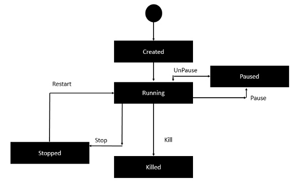

# Docker

Docker is a container management service. The keywords of Docker are develop, ship and run anywhere. The whole idea of Docker is for developers to easily develop applications, ship them into containers which can then be deployed anywhere.

The initial release of Docker was in March 2013 and since then, it has become the buzzword for modern world development, especially in the face of Agile-based projects.

## Features of Docker
- Docker has the ability to reduce the size of development by providing a smaller footprint of the operating system via containers.
- With containers, it becomes easier for teams across different units, such as development, QA and Operations to work seamlessly across applications.
- You can deploy Docker containers anywhere, on any physical and virtual machines and even on the cloud.
- Since Docker containers are pretty lightweight, they are very easily scalable.

## Containers and virtual machlnes 
A container runs natively on Linux and shares the kernel of the host machine with other containers. It runs a discrete 
process. taking no more memory than any other executable. making it lightweight. 
By Contrast. a Virtual (VM) runs a full-blown operating System With to host 
through a hyper-visor. In general, VMS provide an environment with more resources than most applications need. 


## Lifecycle



- Initially, the Docker container will be in the created state.
- Then the Docker container goes into the running state when the Docker run command is used.
- The Docker kill command is used to kill an existing Docker container.
- The Docker pause command is used to pause an existing Docker container.
- The Docker stop command is used to pause an existing Docker container.
- The Docker run command is used to put a container back from a stopped state to a running state.


## Install

### Mac

In Mac Systems you need to install Docker Desktop. The download link is [here](https://docs.docker.com/desktop/mac/install/).

### Ubuntu 20.0.4
1. Uninstall old version

```shell
sudo apt-get remove docker docker-engine docker.io containerd runc
```

2. Update the `apt` package index.

```shell
sudo apt-get update
```

3. Install packages to allow apt to use a repository over HTTPS.

```shell
sudo apt-get install ca-certificates curl gnupg lsb-release
```
4. Add Docker’s official GPG key

```shell
curl -fsSL https://download.docker.com/linux/ubuntu/gpg | sudo gpg --dearmor -o /usr/share/keyrings/docker-archive-keyring.gpg
```

5. Use the following command to set up the stable repository.

```shell
echo \
  "deb [arch=$(dpkg --print-architecture) signed-by=/usr/share/keyrings/docker-archive-keyring.gpg] https://download.docker.com/linux/ubuntu \
  $(lsb_release -cs) stable" | sudo tee /etc/apt/sources.list.d/docker.list > /dev/null
```

6. Update the `apt` package index again.

```shell
sudo apt-get update
```

7. Install Docker engine

```shell
sudo apt-get install docker-ce docker-ce-cli containerd.io
```

### Ubuntu 22.04

Install

```shell
sudo apt update
sudo apt install docker.io
```

## Post-installation steps for Linux (optional)

### Create `Docker` group
```shell
sudo groupadd docker
```

### Add user to the `Docker` group
```shell
udo usermod -aG docker $USER
```

### Confirm Docker installation
```shell
docker version
docker info
```

### Run first `Docker`
```shell
docker run --rm hello-world
```

## More
- [Docker Commands](docker-commands.md)
- [docker-file](docker-file.md)

