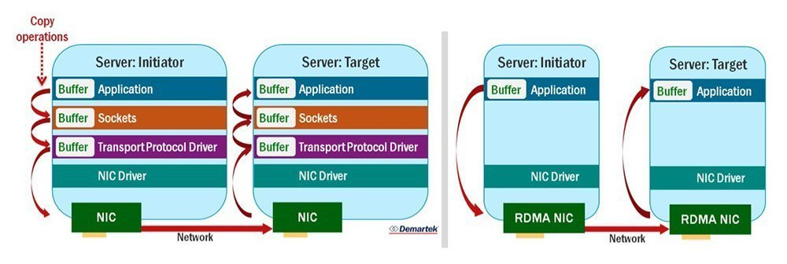
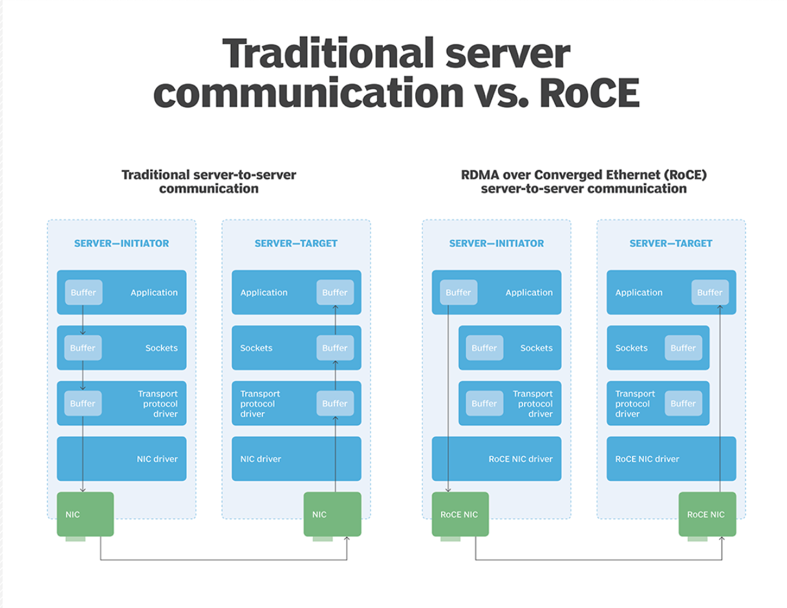
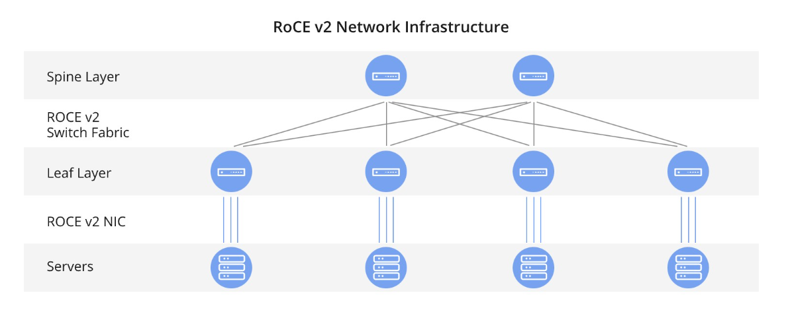
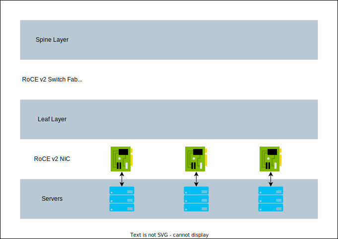
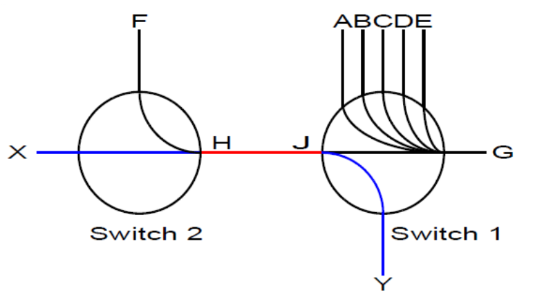

# RDMA

RDMA supports zero-copy networking by enabling the network adapter to transfer data from the wire directly to application memory or from application memory directly to the wire, eliminating the need to copy data between application memory and the data buffers in the operating system. Such transfers require no work to be done by CPUs, caches, or context switches, and transfers continue in parallel with other system operations. This reduces latency in message transfer.

[RDMA Specification](https://datatracker.ietf.org/doc/html/rfc5040)

Network protocols that support RDMA:

1. [InfiBand](#infiniband)
2. [iWARP](#iwarp)
3. [RoCE](#roce)

## InfiniBand

InfiniBand (IB) is a computer networking communications standard used in high-performance computing that features very high throughput and very low latency. It is used for data interconnect both among and within computers. InfiniBand is also used as either a direct or switched interconnect between servers and storage systems, as well as an interconnect between storage systems. It is designed to be scalable and uses a switched fabric network topology. Between 2014 and June 2016, it was the most commonly used interconnect in the supercomputers.

## iWARP

iWARP is a computer networking protocol that implements remote direct memory access (RDMA) for efficient data transfer over **TCP/IPv4** or **TCP/IPv6**. iWARP is not an acronym. [Read mode](understanding_iwarp.pdf)

## RoCE

**RDMA over Converged Ethernet** (RoCE) is a network protocol which allows remote direct memory access (RDMA) over an Ethernet network. There are multiple RoCE versions. RoCE v1 is an Ethernet link layer protocol and hence allows communication between any two hosts in the same Ethernet broadcast domain. RoCE v2 is an internet layer protocol which means that RoCE v2 packets can be routed. Although the RoCE protocol benefits from the characteristics of a converged Ethernet network, the protocol can also be used on a traditional or non-converged Ethernet network.

### RoCE v2

The RoCE version 2 protocol exists on top of either the **UDP/IPv4** or the **UDP/IPv6** protocol. The UDP destination port number **4791** has been reserved for RoCE v2. Since RoCEv2 packets are routable the RoCE v2 protocol is sometimes called Routable RoCE or RRoCE. Although in general the delivery order of UDP packets is not guaranteed, the RoCEv2 specification requires that packets with the same UDP source port and the same destination address must not be reordered. In addition, RoCEv2 defines a congestion control mechanism that uses the IP [ECN](#explicit-congestion-notification) bits for marking and CNP frames for the acknowledgment notification. Software support for RoCE v2 is still emerging. Mellanox OFED 2.3 or later has RoCE v2 support and also Linux Kernel v4.5

<!--  -->

#### Congestion Management

RoCEv2 standard defines RoCEv2 Congestion Management (RCM). RCM provides the capability to avoid congestion hot spots and optimize the throughput of the fabric. With RCM, incipient congestion in the fabric is reported back to the traffic sources that in turn react by throttling down their injection rates, thus preventing the negative effects of fabric buffer saturation and increased queuing delays. Congestion Management is also relevant for co-existing TCP/UDP/IP traffic. However, assuming the intended use of a distinct set of priorities for RoCEv2 and the other traffic (each set of priorities having a bandwidth allocation), the effects of congestion and the reaction (or lack of it) should not impact one another.

For signaling of congestion, RCM relies on the [ECN](#explicit-congestion-notification). Upon congestion that involves RoCEv2 traffic, network devices mark the packets using the ECN field in the IP header. This congestion indication is interpreted by destination end-nodes in the spirit of the FECN congestion indication flag of the Base Transport Header (BTH). In other words, as ECN marks packets that arrive to their intended destination, the congestion notification is reflected back to the source which in turn reacts by rate limiting the packet injection for the QP in question.

## References

### Explicit Congestion Notification

Explicit Congestion Notification (ECN) is an extension to the Internet Protocol and to the Transmission Control Protocol and is defined in RFC 3168 (2001). ECN allows end-to-end notification of network congestion without dropping packets. ECN is an optional feature that may be used between two ECN-enabled endpoints when the underlying network infrastructure also supports it.

Conventionally, TCP/IP networks signal congestion by dropping packets. When ECN is successfully negotiated, an ECN-aware router may set a mark in the IP header instead of dropping a packet in order to signal impending congestion. The receiver of the packet echoes the congestion indication to the sender, which reduces its transmission rate as if it detected a dropped packet.

ECN uses the two least significant (right-most) bits of the Traffic Class field in the IPv4 or IPv6 header to encode four different code points:

|  ECT  |  CE   | Description                            |
| :---: | :---: | :------------------------------------- |
|   0   |   0   | **Not-ECT**: Not ECN-Capable Transport |
|   0   |   1   | **ECT(1)**: ECN Capable Transport(1)   |
|   1   |   0   | **ECT(0)**: ECN Capable Transport(0)   |
|   1   |   1   | **CE**: Congestion Experienced         |

### Network Congestion

Network congestion happens in the network switches when the incoming traffic is larger than the bandwidth of the outgoing link on which it has to be transmitted. Typical example is multiple senders that send traffic to the same destination in the same time. Switch buffers can handle temporal congestion, but when congestion is too long, switch buffer fills up to their buffering capacity. When switch buffer is full the next packets arriving packets are dropped. Dropping packets reduces application performance, due to the latency cost of re-transmission and complexity of transport protocol. Lossless networks implement mechanism of flow control, which pauses the traffic in the incoming link before the buffer overfills, and by that prevents case of dropping packets. However, flow control by itself causes congestion spreading problem.

To understand the congestion spreading problem consider the figure below. Assume that ports A through E on Switch 1 are all sending packets to port G so that port G is receiving data at 100% of its capability to send it. Also assume that port F, on adjacent Switch 2 is also transmitting data to port G on Switch 1 at 20% of the total link bandwidth. Since egress port G is backed up, port F will transmit packets until will be paused by flow control. At this point, port G will be congested, however there is no detrimental side effect, since all ports (A-F) will be served as quickly as port G is able to.

Now consider a port X on Switch 2, which is sending packets to port Y on Switch 1, at 20% of the paths bandwidth. Port G, the source of the congestion is not anywhere in the path from port X to port Y. In this case one might expect that since port F was only using 20% of the inter-switch links bandwidth, the remaining 80% of the links bandwidth would be available for port X, much more than port X requires. However this is not the case, since traffic from port F will eventually cause the flow control to send pauses on the inter-switch link, and reduce the traffic from port X to 20% instead of potentially available 80%.

### Network Congestion Control

Congestion control is used to reduce packet drops in lossy networks or congestion spreading in lossless networks. It also reduces switch buffer occupancy, hence, decreases latency and improves burst tolerance. The approach is to limit the injection rate of flows at the ports which are the root cause of the congestion (ports A-F), so that other ports are not affected (port X).

By limiting the injection rate of ports A-F to something which port G can handle, ports A-F should not see a significant degradation (after all, their packets were just going to wait anyway), however packets being sent from port X to port Y should be able to flow normally, since pauses will not be sent by flow control (congestion control aims to keep switch buffer occupancy low, so the flow control will not kick in).

## Terminology

| Term | Description                               |
| :--- | :---------------------------------------- |
| RP   | Reaction Point                            |
| NP   | Notification Point                        |
| CP   | Congestion Port                           |
| CNP  | The RoCEv2 Congestion Notification Packet |
